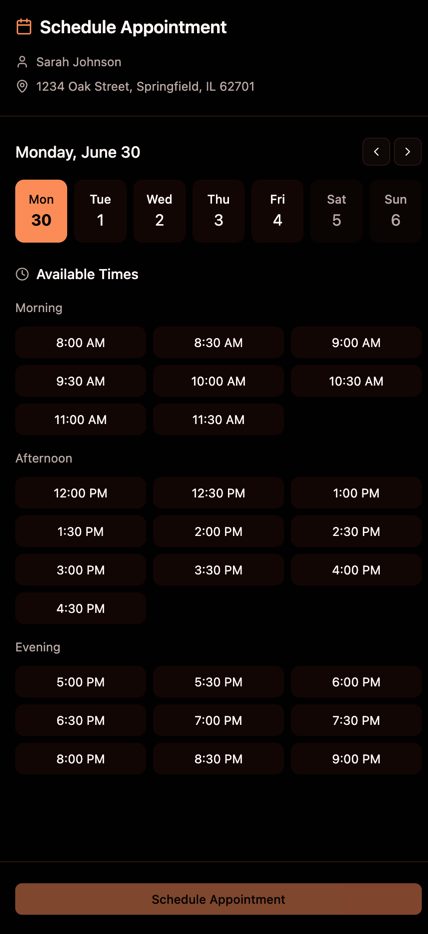

# SunCRM Executive Summary

## Document Information
**Product Name:** SunCRM - Solar Sales Management Platform  
**Version:** 2.0 (Production)  
**Document Version:** 1.0  
**Date:** August 2025  
**Status:** Approved  
**Stakeholders:** Executive Team, Product Management, Engineering, Sales Operations

## Product Overview

SunCRM is a solar sales management platform. It is a web and mobile application that helps salespeople manage their sales and sales teams.

The application will contain a full suite of communication tools for both internal and external communications. These will include:

- A full-featured email client inspired by Apple Mail
- An SMS message client
- An IP telephony system
- WEB-RTC video conferencing
- A full-featured chat client inspired by Slack

## Lead Management Dashboard

## Sales Management Dashboard

## Sundialer

The application will contain an incoming and outgoing call center feature called Sundialer. The purpose of Sundialer is to support Setter in setting appointments for Consultants. When a Setter sets an appointment, the system assigns it to a Consultant. Setters do not take appointments, they only set them. Setters do not assign appointments to Consultants.

Sundialer places outgoing calls using a predictive dialer, and also receives incoming calls and distributes both incoming and outgoing calls to signed in users called Setters. A person who calls into Sundialer, or who is called by Sundialer is referred to as a Person. A person is not a user of the system, and does not have an account on the system or sign in credentials. A Person has a first name, a last name, a phone number, and an email address. Each Person belongs to at least one Organization. An organization may be a household, a company, a non-profit, a religious organization or a government agency, or some other kind of organization. A person may belong to many organizations. Each person has an Organization Role, such as husband or president, within each orgainization that he or she belongs to.

The Setter will be taken to the Setter Dashboard after joining a campaign. If the Setter has not yet joined a campaign, the list of avaiable campaigns will be displayed, and the setter will click on a campaign to join it. Campaigns are created and managed by Lead Managers. Setter managers configure which Setters may join which campaigns in a separate dashboard. Once a Setter has joined a campaign the setter is taken to the Sundialer Setter Dashboard. At this point, the Setter is Active, meanign that the Setter is available to have calls outgoing and incoming calls routed to them by the system. A Setter may pause their active state (for example to take a break of any length) by clicking on the pause button in the top info bar. A Setter may also leave a campaign by clicking on the leave campaign button in the top info bar, taking the Setter back to the campaign selection screen. A Setter may also sign out of the applications by clicking the Sign Out menu item in the user menu in the top nav bar.

### Top Nav Bar

The application will have a top nav bar that appears at the top of all pages. The contents of the top nav bar will vary depending on the roles of the user.

For Setters, the top nav bar will contain the following:

**Left group**  

- Logo (links to home page)

**Center group**  

- Dashboard
- Calendar
- Chat

**Right group**  

- Notifications Menu Icon
- User Menu Icon

### Top Info Bar

The top info bar will contain the following:

- Number of sets today
- Number of sets this week
- The button that opens the Leaderboard modal
- A realtime time display that shows the amount of time the Setter has been active today and this week

### Sundialer Setter Dashboard

The Sundialer Setter Dashboard will be the main user interface for the Sundialer feature of the application. When a call placed by the predictive dialer connects, or an incoming call call comes in to the call center, the call will automatically be to an active Setter using a round robin algorithm. The System will play a sound to indicate that a live call is being routed to them, and the call will be conncted to the Setter. The Setter does not have to answer the call. It is live the moment it is assigned to them. When a call is assigned, the corresponding Organization and Person will be displayed in the Sundialer Setter Dashboard. Notes and call history will also be displayed. The Map will show the street address of the Organization. The correct script will be displayed.

Use this mockup of the Dashboard for inspiration! [sundialer-setter-dashboard.png](assets/sundialer-setter-dashboard.png).

The main content area of the dashboard will have a three column layout. A major feature will occupy each column.

#### People UI

The left column will be a display of the Organization to which the Person with whom the Setter is curently speaking belongs. All of the People belonging to this organization will be displayed compactly, stacked vertically. It will be possible to rearrange the People using drag-and-drop. The Person on the top will uniquely be marked as primary, and moving a Person to the top position will cause that person to be marked as primary. This page is part of the Sundialer feature of this application.

The People UI will also allow Setters to edit person details including assigning an Organization Role. This will be done by clicking on the Person in the People UI, and then selecting the Organization Role from a dropdown menu.

A setter may remove a Person from an organization. In this case, the person record is not actually deleted, but the person is marked as inactive. The setter will have to select the reason for removing the person from the organization (e.g., left the organization, divorced, deceased, etc., or other) and may enter a comment.

A Setter will be able to create a scheduled callback for a Person. This will be done by clicking on the Person in the People UI, and then selecting the date and time from a date picker. The date and time will be displayed in the People UI.

When a call concludes, the Setter will be prompted to select a call disposition for the call. The call and its disposition will be added to the call history.

#### Script Prompting

The center panel of the Sundialer Setter Dashboard. This will contain a script prompting component. The component will display a series of script sections. Clicking anywhere on a section will toggle a checkbox that indicates whether the section has been completed. A progress bar at the top will show how many sections have been completed. There will be a button for setting an appointment at the bottom of the script prompting component. This button will be initially disabled, and will become enabled when all of the script sections have been completed.

#### Notes / Call History and Map 

The third content pane in the Sundialer Setter Dashboard will contain two components stacked vertically. The top component will be a tab pane containing two tabs, a notes tab, and a call history tab. The notes tab will contain a rich tesxt editor for entering and editing notes about the current organization and it's people. The second tab will contain a call history detailing all the calls involving the current organization, which person participated in each call, and the outcome of each call. The bottom component will contain a mapbox map showing the street address of the current organization.

#### Leaderboard

A leaderboard will be displayed in a full-screen modal when a Setter clicks on the leaderboard button. The leaderboard will display summary performance statistics for the setter at the top, with a table below showing summary statistics for each setter. The Setter will be able to select Day, Week, Month, or Year-to-Date to view the leaderboard for that period.

Here are the statistics that will be displayed:

- Calls - Number of calls handled by the Setter
- Completed - The number of calls in which the entire script was completed
- Sets - Number of appointments set by the Setter
- Mets - The number of appointments set by the Setter that resulted in a meeting
- QMets - The number of fully qualified appointments set by the Setter
- Sales - The number of appointments set by the Setter that resulted in a sale

The table sill be sortable by any of the columns.

The far right column will contain a play button. Clicking the play button will display a mini-player and will play the most recent call for the Setter that resulted in an appointment being set.

Use this mockup of the Leaderboard for inspiration .

#### Appointment Setting UI

When a setter clicks on the button to set an appointment, a drawer will slide out from the left side of the screen. The form will contain a UI displaying available times for the setter to set an appointment. A time is available if one or more Consultants has an opening during that time. Setters do not choose consultants, only times. When a Setter clicks on a time, the system will assign the appointment to a Consultant with an available Consultant. If no other consultants have openings in the selected time slot, the UI will update for all Setters to indicate that the time slot is unavailable. Appointments will be assigned to available Consultants using a round robin algorithm with weights based on Consultant performance.

While the drawer is open, the UI in the second and third columns of the Dashboard will be visible and enabled. This will allow the Setter to continue to follow script prompts, take notes, view the call history, and view the map. Clicking outside the Appointment Setting UI will not close the drawer. Rather, a cancel button will be displayed in the drawer. Clicking the cancel button will close the drawer and the UI will return to its previous state.

Use this mockup of the Appointment Setting UI for inspiration 

Note that this mockup is missing the cancel button.

#### Setter Manager Dashboard

Setters are managed by a Setter Manager. The Setter Manager Dashboard will display statistics for all Setters, similar to what is displayed in the Leaderboard. The Setter Manager will also be able to click on the name of a Setter to view and edit their details, listen to all call recordings, view attendance and performance statistics, view the call history, listen to a Setter's current call, and listen to any of the the Setter's previous call recordings. The AI system will analyze each Setter's calls, dispplay performance metrics based on this analysis, and highlight areas that need improvement.

### Lead Management

Admins will be able to use an AI-powered, intelligent ETL (Extract, Transform, Load) system that automates 90% of lead processing tasks while providing intuitive controls for the remaining 10% that require human judgment. Leads are provided by multiple vendors and in multiple formats, such as CSV files, JSON files, and Excel files. Lead files commonly contain capitalization and other errors. The system will:

- **Auto-detect formats** and suggest optimal column mappings using machine learning
- **Transform data intelligently** with AI-powered normalization and enrichment
- **Provide real-time previews** of all transformations before committing
- **Ensure compliance** through automated DNC scrubbing and validation
- **Enable self-service** for non-technical users through delightful UX

### Calendar

Each Setter will be able to view their calendar. The calendar will display all appointments they have set, as well as scheduled callbacks, and in-house meeting times. The calendar will be displayed in a full-screen modal. The calendar will support day, week, and month views.

## Design system

All UI should be built using shadcn UI components when suitable components are available. shadcn blocks should be used for complex components when suitable blocks are available. All components should be responsive and should meet the highest accessibility standards. The tweakcn theme called Tangerine should be used throughout the application.

All components for editing data should use inline editing. The application must have a complete, world-class set of inline editing components.

The app should support both light and dark themes. The user should be able to configure which theme they prefer in their settings.

## AI Features

The system will contain and AI system that will listen to and analyze calls and provide visual hints to the Setter during the call based on this real-time analysis. A hint might suggest a word or phrase that the setter should say, or it may suggest that the setter slow down (or speed up), or change tonality, or it may make some other appropriate suggestion. The AI system will also detect each time the Setter completes a script section, and will provide a visual hint to the Setter to indicate that the section has been completed, and will check off the section in the script prompting component. In particular, the system will visually remind the Setter to ask each of the qualifying questions in the script.

Each section of the script has a specific purpose and goal. For example, the purpose of the introduction section is to establish instant rapport with the Person, and the goal is to engage the Person and get a positive response, rather than have the Person terminate the call. Scripts are authored and managed by the Setter Manager and the Sales Manager in a separate dashboard. The AI should evaluate in real-time whether the Setter is meeting the script section goals, and provide visual hints to the Setter to help them meet the goals.

The visual hints should not distract the Setter from the call. Setters should be able to dismiss a hint by clicking on it, and should be able to toggle hinting on and off. Experienced Setters may not require hints at all, and may want to disable them.